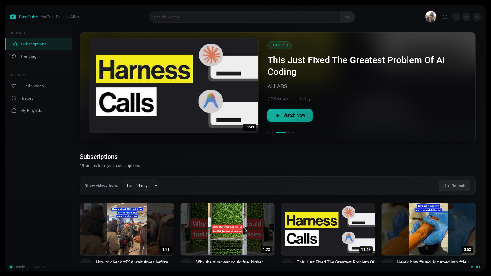

# ElecTube


A native desktop YouTube client with a grid-view interface, built on Electron + React. Videos play through mpv with yt-dlp for best-quality streaming. No browser, no ads, no fluff.

<p align="center">
  
</p>

## What It Does

ElecTube connects to the YouTube Data API v3 to browse trending videos, subscriptions, liked videos, watch history, and playlists. Click any video and it opens in mpv at up to 1080p. Right-click to open in your default browser as a fallback.

The app ships with its own mpv and yt-dlp binaries, downloaded automatically on first launch. Nothing extra to install.

Authentication is handled via Google OAuth 2.0. Without OAuth credentials, ElecTube runs in anonymous mode and shows trending content + search.

## Features

- **Trending feed** with pagination (US region, 25 per page)
- **Subscription feed** with batched channel fetching, sorted by publish date
- **Liked videos** and **watch history** views
- **Playlist library** with inline video browsing
- **Full-text search** returning up to 25 results with duration, view counts, and relative timestamps
- **Featured carousel** for top 5 videos in trending/subscription views, auto-advances every 8 seconds
- **Age filter** for subscription feed (Today, 3/7/14/30 days, All time)
- **Infinite scroll** with Intersection Observer on paginated views
- **mpv playback** at up to 1080p via yt-dlp format selection
- **Browser fallback** on right-click
- **Google OAuth 2.0** with automatic token refresh (5-minute buffer before expiry)
- **Persistent auth** via electron-store, survives restarts
- **Dark glassmorphism UI** with custom accent color (#FF0033), skeleton loaders, staggered grid animations
- **Frameless window** with custom title bar, macOS-style traffic light controls, draggable regions
- **Self-contained binaries** (mpv AppImage + yt-dlp) auto-downloaded to `bin/` on first run
- **Auto-updates** yt-dlp if the binary is older than 7 days

## Tech Stack

| Layer | Technology |
|-------|-----------|
| Framework | Electron 33 |
| Renderer | React 18, Vite 5 |
| Language | TypeScript 5.3 |
| State | Zustand 4.5 |
| Styling | TailwindCSS 3.4 + custom glassmorphism CSS |
| YouTube API | googleapis (YouTube Data API v3) |
| Auth | Google OAuth 2.0 with local HTTP callback |
| Playback | mpv (AppImage) + yt-dlp |
| Persistence | electron-store |
| Build | electron-builder (AppImage, deb) |

## Requirements

- Node.js 20+
- npm 9+
- Linux x86_64
- A YouTube Data API v3 key (get one from the [Google Cloud Console](https://console.cloud.google.com/apis/credentials))

## Quick Start

```bash
git clone https://github.com/sanchez314c/elec-tube
cd elec-tube
./run-source-linux.sh
```

The launch script handles everything on first run:
1. Downloads mpv AppImage and yt-dlp to `bin/`
2. Installs `node_modules` if missing
3. Compiles the main process TypeScript
4. Starts the Vite dev server on port 50826
5. Launches Electron pointing at the dev server

Press `Ctrl+C` to kill everything cleanly.

## Environment Variables

Export these in your shell or add them to `~/.bashrc`:

```bash
# Required for search and trending
export YOUTUBE_API_KEY="your_youtube_data_api_v3_key"

# Optional - only needed for subscriptions, liked videos, history, and playlists
export YOUTUBE_CLIENT_ID="your_oauth_client_id"
export YOUTUBE_CLIENT_SECRET="your_oauth_client_secret"
```

Get API credentials from [Google Cloud Console](https://console.cloud.google.com/apis/credentials) > APIs & Services > Credentials. You need a YouTube Data API v3 key, and optionally an OAuth 2.0 client ID (type: Desktop app) for authenticated features.

## Views

| View | Auth Required | Description |
|------|:---:|---|
| Trending | No | Most popular videos in the US, paginated |
| Search | No | Full-text video search, up to 25 results |
| Subscriptions | Yes | Recent videos from subscribed channels, with age filter |
| Liked Videos | Yes | Your liked video history |
| Watch History | Yes | Your watch history (may be restricted by YouTube) |
| My Playlists | Yes | Your YouTube playlists with video counts |

## Development

### Manual Setup

```bash
npm install

# Run both processes concurrently
npm run dev

# Or run them separately
npm run dev:renderer   # Vite on port 50826
npm run dev:main       # Compile main process + launch Electron
```

### Build Commands

```bash
npm run build              # Build renderer + main
npm run build:main         # TypeScript compile main process only
npm run build:renderer     # Vite build renderer only
npm run start              # Run the production build
npm run package            # Build + package with electron-builder
npm run package:linux      # Build + package for Linux (AppImage, deb)
```

### Project Structure

```
src/
  main/
    index.ts          # Electron app lifecycle, IPC handlers, window management
    preload.ts        # Context bridge exposing window.electube API
    youtube-api.ts    # YouTube Data API v3 wrapper (googleapis)
    oauth.ts          # Google OAuth 2.0 flow with local HTTP callback server
  renderer/
    App.tsx           # Root component, auto-authentication bootstrap
    main.tsx          # React entry point
    store/
      appStore.ts     # Zustand state: views, videos, pagination, auth, filters
    components/
      TitleBar.tsx    # Search bar, window controls, user avatar, app logo
      Sidebar/
        Sidebar.tsx   # Navigation items, playlist list, library section
      Grid/
        VideoCard.tsx       # Video thumbnail with hover play overlay
        VideoGrid.tsx       # Responsive grid with infinite scroll
        PlaylistCard.tsx    # Playlist card with item count overlay
        PlaylistGrid.tsx    # Playlist grid view
        FilterBar.tsx       # Age filter dropdown + refresh button
        VideoCardSkeleton.tsx  # Loading placeholder
      Featured/
        FeaturedCarousel.tsx   # Hero carousel for top 5 videos
      Auth/
        UserAvatar.tsx   # Google profile picture, login/logout dropdown
    styles/
      index.css        # Glassmorphism design system, animations, custom components
    types/
      electron.d.ts    # TypeScript interfaces for the IPC bridge
```

### Architecture

**Two-process model:**

- **Main process** (Node.js): Handles YouTube API calls, OAuth flow, mpv spawning, and electron-store persistence. All external I/O lives here.
- **Renderer process** (Browser): React UI with Zustand state management. Communicates with main via `ipcRenderer.invoke()` through a preload context bridge.

**IPC naming convention:** `namespace:action` (e.g., `youtube:getTrending`, `player:play`, `auth:login`). Components never call IPC directly; they go through `window.electube.*`.

**Video playback:** The main process spawns mpv as a detached child process with yt-dlp as the format hook:
```
mpv --ytdl-format=bestvideo[height<=?1080]+bestaudio/best --script-opts=ytdl_hook-ytdl_path=<yt-dlp> <url>
```

**TypeScript setup:** Two separate configs. `tsconfig.json` handles the renderer (React, ESNext, bundler resolution). `tsconfig.main.json` handles the main process (CommonJS, Node resolution, outputs to `dist/main/`).

### Linux Sandbox Note

Electron's sandbox is disabled for Linux compatibility. The launch script and main process both apply `--no-sandbox`. If you want to run with sandbox enabled:

```bash
sudo sysctl -w kernel.unprivileged_userns_clone=1
```

## Contributing

See [CONTRIBUTING.md](CONTRIBUTING.md) for setup instructions, code conventions, and how to submit changes.

## License

MIT - see [LICENSE](LICENSE)
